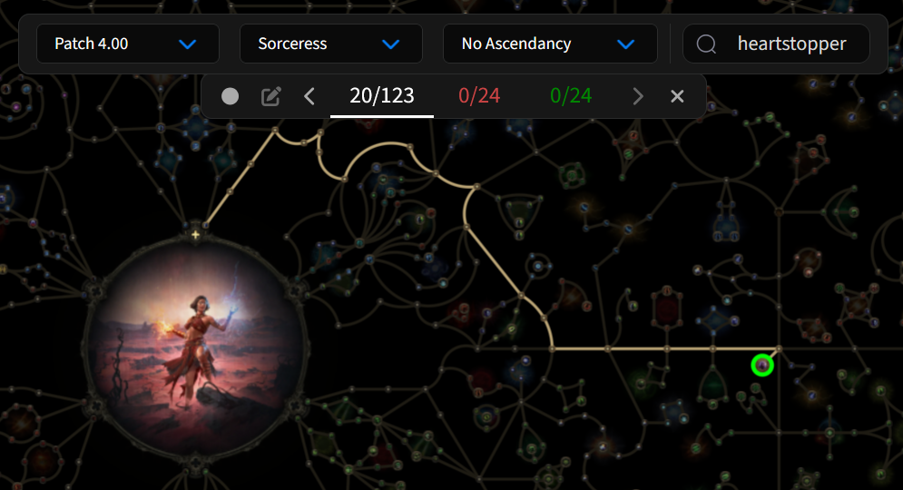

# Untitled Path of Exile 2 Roguelike Challenge - PRE-ALPHA RULESET

## Overview

The goal of the challenge is to complete Path of Exile 2's pinnacle endgame content in a hardcore league, while abiding by certain parameters that are randomly chosen for the player at the start of a run. The challenge can have a trade league variant as well as a solo self found variant

## TLDR

1. Create a new character with a **randomly chosen ascendency** in a **hardcore** league.
2. Randomly roll a single **keystone passive node**. You must build towards and around this node, and take this specific keystone node as a passive selection before spending a certain number of passive points. Using a build guide is against the spirit of the challenge.
3. Fight your way to and complete POE2's pinnacle content.
4. If at any point your character dies, re-roll a new random ascendency and keystone, create a new character, and go again.

## Why I created this challenge

I created this challenge with two primary aims in mind

1. Create a way to learn POE2 on a deep level by forcing myself to engage with mechanics I otherwise might avoid or overlook, with a high level of stakes and difficulty, requiring a deeper engagement with the game's mechanics to succeed.
2. Fun - the roguelike/roguelite template is a large part of some of my most favorite games, and I think the mechanics of this challenge will make Path of Exile 2 even more enjoyable than it already is.

## Detailed Rules

1. Create a new character. You may choose to check or uncheck the Solo Self-Found toggle, but you must create the character in a Hardcore league. At the point of character creation, you must determine your _class_ and eventual _ascendency_ by choosing from the available options randomly. Any method of random selection is allowed, but for ease of use, just spin [this wheel](https://spinthewheel.app/oEKjn0d9YN). You must select the class corresponding with the selected ascendency. Re-rolling off of unwanted ascendencies/classes is against the spirit of the challenge. If, during this run, you manage to ascend, you must choose the ascendency rolled at this step, so make a note of your result for later.
2. Now you must roll one [Keystone](https://spinthewheel.app/NvSke91Jpb) around which you will have to build during this run, selected from [the comprehensive list of all keystone passives in the game](https://www.poe2wiki.net/wiki/Keystone). Keep in mind that many runs will end before ever having reached the target Keystone passive, and that's OK. Once you've rolled a keystone, you must determine how many passive points you are permitted to spend before you **must** taken the rolled keystone passive, according to the following process:
   1. Go to [the POE2 Passive Skill Tree Planner]() and select your starting class from the dropdown at the top.
   2. Next, search for and select your rolled passive keystone on the tree. The planner will tell you the minimum number of nodes that are required to reach your rolled keystone (20, in the example shown here)
   
   3. Multiply this number by 1.5, rounding up to the next integer whole number (30, in the example above). The resulting number is the cutoff by which you must take the rolled keystone passive. From that point on, this keystone may not be refunded.
3. Finish creating your character and begin the game. Attempt to complete the game's pinaccle endgame content according to these two requirements: you _must_ select your rolled ascendency upon ascension, and you _must_ take your rolled keystone passive on or before spending the calculated number of passive points.
4. If you die at any point, roll a new ascendency and keystone, create a new character according to those requirements, and try again.

## FAQ

## TODO

If successful, I'll consider making some dedicated tools for use with the challenge.